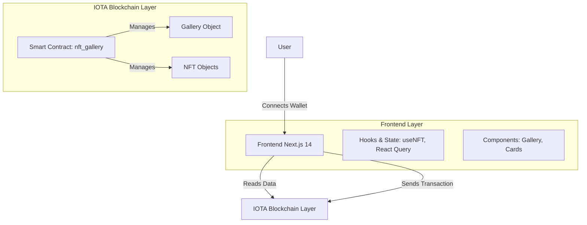
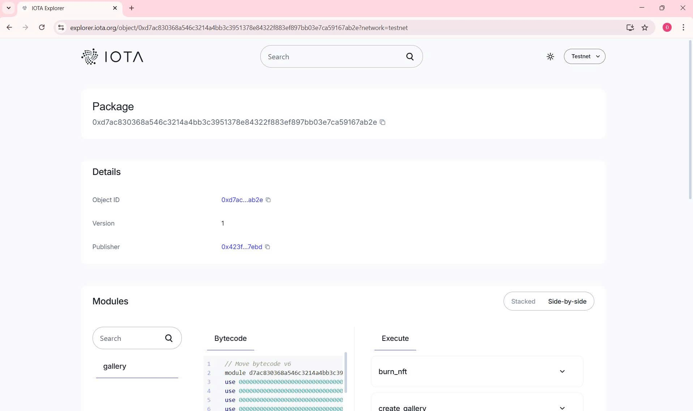

# 🎨 NFT Gallery dApp - Full Stack IOTA Project

A complete decentralized NFT marketplace built on the IOTA blockchain. Users can create galleries, mint NFTs, transfer ownership, and manage their digital art collection securely.

---

## 📋 Table of Contents

- [Live Demo](#-live-demo)
- [Features](#-features)
- [Architecture](#️-architecture)
- [Project Structure](#-project-structure)
- [Technologies Used](#️-technologies-used)
- [Getting Started](#-getting-started)
- [Smart Contract API](#-smart-contract-api)
- [Deployment](#-deployment)
- [Contributing](#-contributing)
- [Contract Address](#-contract-address)

---

## 🌐 Live Demo

- **Frontend:** `http://localhost:3000` (local development)
- **Testnet Explorer:** [View on IOTA Explorer](https://explorer.iota.cafe?network=testnet)
- **Package ID:** `0xd7ac830368a546c3214a4bb3c3951378e84322f883ef897bb03e7ca59167ab2e`
- **Network:** IOTA Testnet

---

## ✨ Features

### Smart Contract Features
- ✅ **Create Personal Gallery** - Each user has their own unique NFT gallery object.
- ✅ **Mint NFTs** - Create unique digital assets with custom metadata.
- ✅ **Transfer Ownership** - Securely send NFTs to other wallet addresses.
- ✅ **Burn NFTs** - Permanently destroy unwanted NFTs.
- ✅ **Update Metadata** - Modify NFT descriptions post-minting.
- ✅ **View Functions** - Publicly query NFT and gallery information.
- ✅ **Event Emission** - Track minting activities on-chain.
- ✅ **Owner Protection** - Strict access controls ensure only owners can modify their assets.

### Frontend Features
- ✅ **Wallet Integration** - Seamless IOTA wallet connection (Browser Extension).
- ✅ **Beautiful UI** - Modern, gradient-based design using Tailwind CSS.
- ✅ **NFT Grid Display** - Responsive gallery view for collections.
- ✅ **Mint Form** - Easy-to-use interface for creating new NFTs.
- ✅ **Transfer Modal** - Simple workflow for transferring assets.
- ✅ **Burn Confirmation** - Safety checks and warnings before deletion.
- ✅ **Real-time Stats** - View collection statistics instantly.
- ✅ **Loading States** - Clear user feedback during transactions.
- ✅ **Error Handling** - Graceful error messages for failed interactions.
- ✅ **Mobile Responsive** - Optimized layout for all devices.
- ✅ **IPFS Support** - Compatible with IPFS image URLs.

---

## 🏗️ Architecture

### System Overview



### Data Flow

1. **Initialization:**
   - User connects wallet → Frontend detects account.
   - User creates gallery → Gallery object stored on-chain.

2. **Minting:**
   - User fills mint form → Frontend validates input.
   - Transaction sent → Smart contract creates NFT object.
   - NFT transferred to user's wallet.

3. **Transfers:**
   - User enters recipient address → Frontend builds transaction block.
   - Ownership transferred → NFT moves to new wallet address.

4. **Viewing:**
   - Query blockchain → Fetch user's NFT objects.
   - Display in grid → Real-time updates via React Query.

---

## 📁 Project Structure

```text
nft_gallery_dapp/
├── backend/                         # Smart Contract (Move)
│   ├── Move.toml                    # Package config
│   ├── README.md                    # Backend specific docs
│   └── sources/
│       └── nft_gallery.move         # Main contract logic
│
└── frontend/                        # Next.js App
    ├── app/
    │   ├── layout.tsx               # Root layout
    │   ├── page.tsx                 # Entry point
    │   └── globals.css              # Global styles
    ├── components/
    │   ├── Provider.tsx             # IOTA dApp Kit Provider
    │   ├── NFTGallery.tsx           # Main gallery UI
    │   └── NFTCard.tsx              # Individual NFT display
    ├── hooks/
    │   └── useNFT.ts                # Contract interaction hooks
    ├── lib/
    │   └── config.ts                # App configuration (Package IDs)
    ├── types/
    │   └── index.ts                 # TypeScript interfaces
    └── package.json                 # Dependencies
```

### Smart Contract Module Structure

**Module:** `nft_gallery::gallery`

- **Structs:**
  - `NFT`: Stores ID, name, description, URL, creator.
  - `Gallery`: Stores ID, owner address, NFT count.
  - `NFTMinted` (Event): Emitted upon successful minting.
- **Functions:**
  - `create_gallery`, `mint_nft`, `transfer_nft`, `burn_nft`, `update_description`.
  - `get_nft_info`, `get_gallery_info` (View functions).

---

## 🛠️ Technologies Used

**Frontend:**
- **Framework:** Next.js 14
- **Language:** TypeScript
- **Styling:** Tailwind CSS
- **Blockchain SDK:** @iota/dapp-kit, @iota/sdk
- **State Management:** React Query

**Backend:**
- **Language:** Move (IOTA Smart Contracts)
- **Network:** IOTA Testnet
- **Tools:** IOTA CLI

---

## 🚀 Getting Started

### Prerequisites

- **Node.js:** v18+ and npm
- **IOTA CLI:** v1.12.0+
- **Wallet:** IOTA Wallet (Browser Extension)
- **Git**

### Installation Steps

#### 1. Clone Project
```bash
cd /path/to/your/project/nft_gallery_dapp
```

#### 2. Deploy Smart Contract
```bash
# Navigate to backend
cd backend

# Build contract
iota move build

# Deploy to testnet
iota client publish --gas-budget 100000000

# 📝 IMPORTANT: Copy the Package ID from the output!
```

#### 3. Setup Frontend
```bash
# Navigate to frontend
cd ../frontend

# Install dependencies
npm install

# Update configuration
# Open lib/config.ts and replace the placeholder with your Package ID
nano lib/config.ts
# const PACKAGE_ID = "0xd7ac830368a546c3214a4bb3c3951378e84322f883ef897bb03e7ca59167ab2e"; 
```

#### 4. Run Application
```bash
npm run dev
```
Open **http://localhost:3000** in your browser.

---

## ⚡ Quick Start Workflow

**Terminal 1 (Backend):**
```bash
cd backend
iota move build
iota client publish --gas-budget 100000000
```

**Terminal 2 (Frontend):**
```bash
cd frontend
npm install
npm run dev
```

**Browser:**
1. Open `http://localhost:3000`
2. Connect Wallet
3. Click "Create Gallery"
4. Start Minting!

---

## 📜 Contract Address

https://explorer.iota.org/object/0xd7ac830368a546c3214a4bb3c3951378e84322f883ef897bb03e7ca59167ab2e?network=testnet




